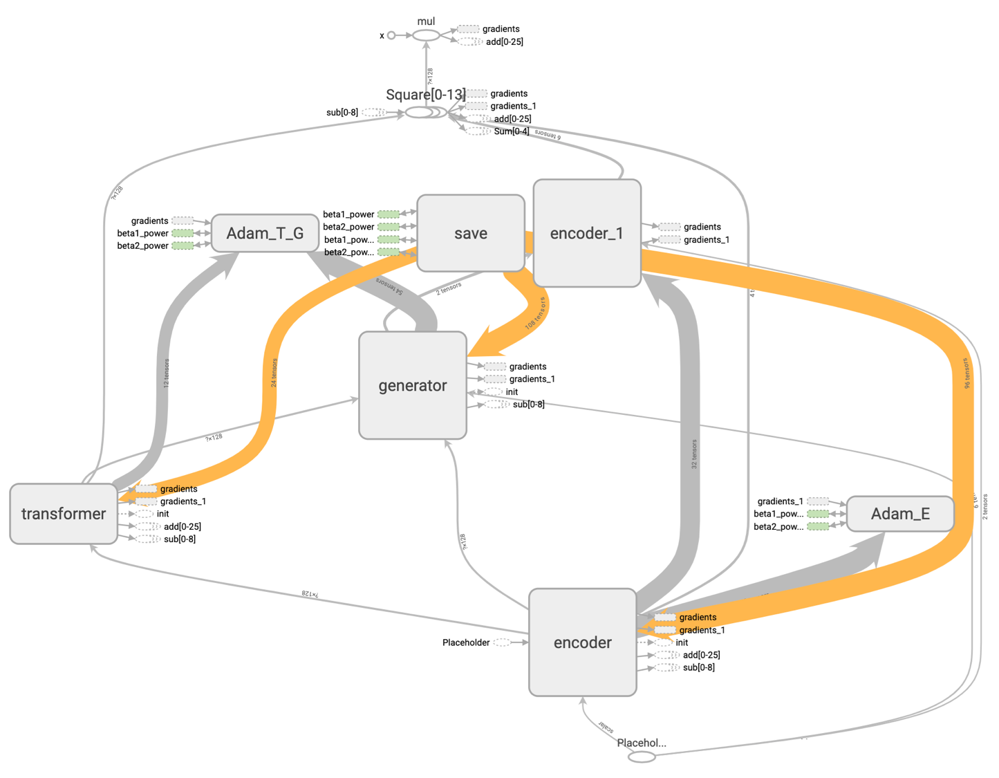
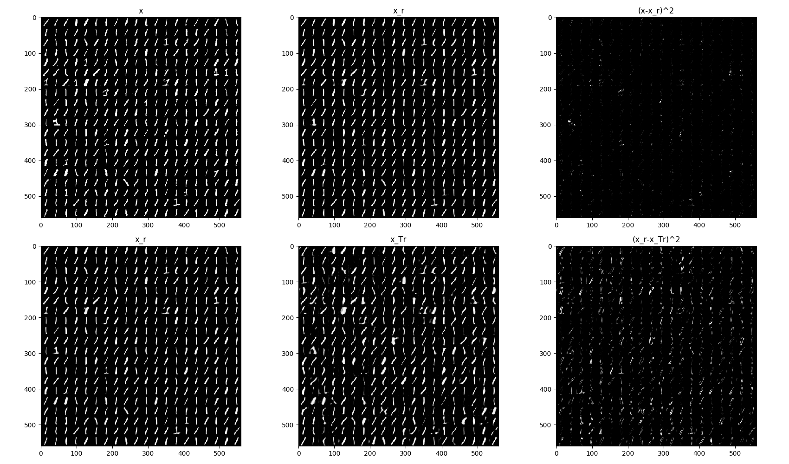
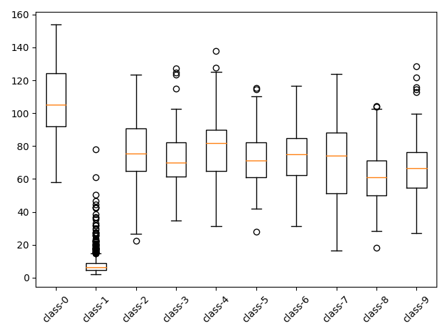
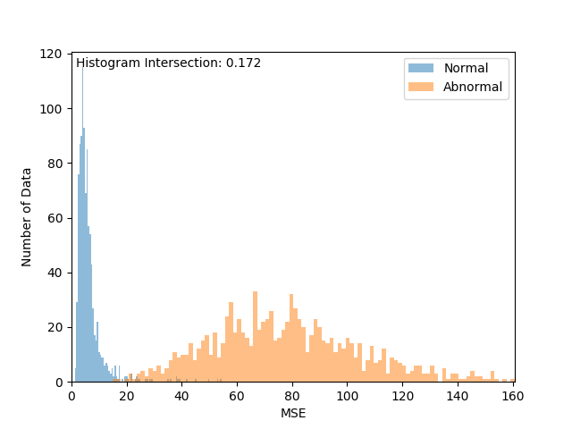
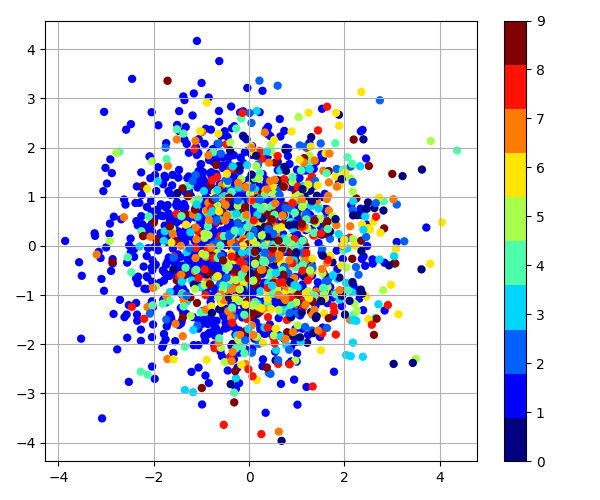
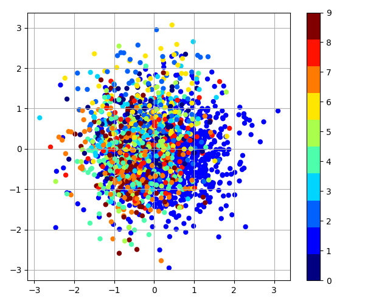

Self-AVAE (Self-adversarial Variational Autoencoder)
=====

Implementation of 'Self-adversarial Variational Autoencoder with Gaussian Anomaly Prior Distribution for Anomaly Detection' (Self-AVAE) [<a href="https://github.com/YeongHyeon/CVAE-AnomalyDetection">Related repository</a>].

## Architecture

    
  
Simplified Self-AVAE architecture.

## Graph in TensorBoard

    
  
Graph of Self-AVAE.

## Results

    
  
Restoration result by Self-AVAE.

  
  
Box plot and histogram of restoration loss in test procedure.

  
  
Normal latent space, and transformed latent space (regared as abnormal).

## Environment
* Python 3.7.4  
* Tensorflow 1.14.0  
* Numpy 1.17.1  
* Matplotlib 3.1.1  
* Scikit Learn (sklearn) 0.21.3  

## Reference
[1] Xuhong Wang, et al. (2019). <a href="https://arxiv.org/abs/1903.00904">Self-adversarial Variational Autoencoder with Gaussian Anomaly Prior Distribution for Anomaly Detection.</a>. arXiv preprint arXiv:1903.00904.
